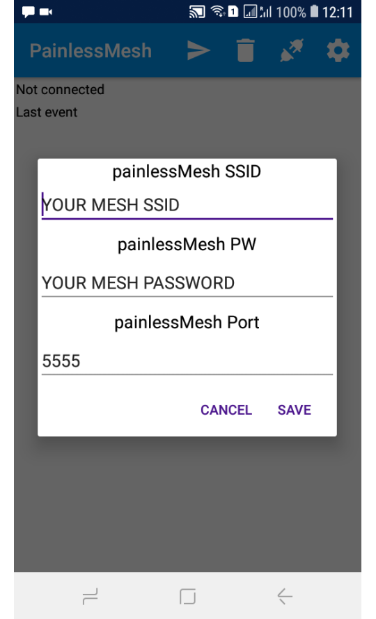
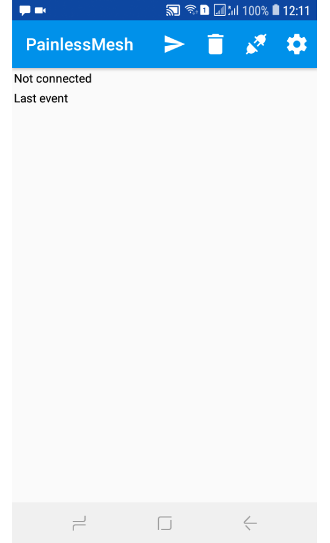

Just out of curiosity and to see if it is possible I wrote a small app for Android that can connect to a painlessMesh network and act like a node.
So far the app can connect, request routing info (NODE_SYNC_REQUEST) and send single (SINGLE) and broadcast (BROADCAST) messages. 
Restrictions:
- Not supported are (TIME_DELAY), (TIME_SYNC) and (NODE_SYNC_REPLY). 
- The app is connecting to the closest painlessMesh AP. Due to restrictions of Android it can not have AP and STA mode running in parallel.

The app is published on Google Play (pending) as PainlessMesh Listener and on **[www.apkfiles.com](https://www.apkfiles.com/apk-593855/painlessmesh-listener)**.
The source code is available as well on **[BitBucket](https://bitbucket.org/beegee1962/painlessmesh_android/src/master/)**. 

- The app is 100% open source and has no ads.
- The app asks for the user permission to access location because since Android > V6 requires permission from the user for location service to scan WiFi networks. Makes no sense, but that's how it is :(

**Some screenshots:**    
First start:    
   
Enter painlessMesh network credentials by pushing the settings button:    
    
Before connecting, to connect push the connect button:    
    
After connection is established received user packets are displayed as a scrollable list and last control package received is shown as status:    
    
For sending user packages a list of connected nodes is displayed for selection, push the send button to start sending:    
    
The user package message can be entered as text (e.g. as a JSON object):    
    
The list of received user packages can be cleared by using the bin button