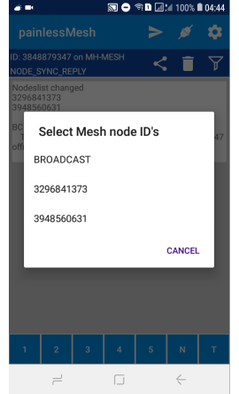
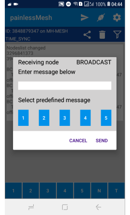

Just out of curiosity and to see if it is possible I wrote a small app for Android that can connect to a painlessMesh network and act like a node.
So far the app can connect, request routing info (NODE_SYNC_REQUEST) and send single (SINGLE) and broadcast (BROADCAST) messages. 
Restrictions:
- Not supported are (TIME_DELAY), (TIME_SYNC) and (NODE_SYNC_REPLY). 
- The app is connecting to the closest painlessMesh AP. Due to restrictions of Android it can not have AP and STA mode running in parallel.

The app is published on **[Google Play](https://play.google.com/store/apps/details?id=tk.giesecke.painlessmesh)** on **[apkFiles.com](https://www.apkfiles.com/apk-595242/painlessmesh-listener)** and on **[F-Droid](https://f-droid.org/en/)** (pending).
The source code is available on **[Gitlab](https://gitlab.com/beegee1962/painlessmesh_android)**.    
Website with more information: [painlessMesh and Android](https://desire.giesecke.tk/index.php/2019/04/09/painlessmesh-and-android/)

- The app is 100% open source and has no ads. (MIT license)
- The app asks for the user permission to access location because since Android > V6 requires permission from the user for location service to scan WiFi networks. Makes no sense, but that's how it is :(

**Some screenshots:**    
First start, app requesting permission:    
   
Settings main screen:    
    
Credentials settings:    
    
Setup predefined messages:    
    
Connected, receiving messages, possible to send predefined messages as broadcast from buttons at buttom:    
    
Sending messages, first select of nodeId:    
    
Sending messages, type message or select from predefined messages:    
    
Display of received messages can be filter by nodeID:    
    